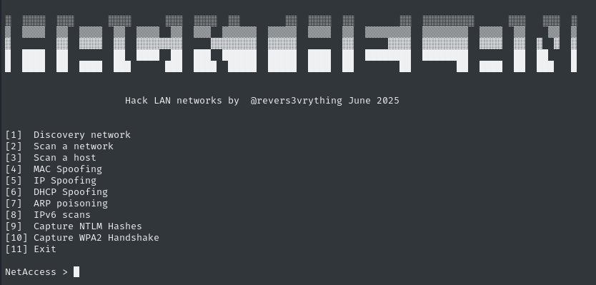

# HackTheLan 🛠️


**HackTheLan** is an all-in-one automated offensive toolkit designed for **pentesters and red teamers** who need to perform **on-site LAN/WLAN attacks and network reconnaissance** efficiently. Built mainly with **Python and Scapy**, this tool brings together multiple attack and discovery capabilities in a single interface. Also this tool include SilentBridge that allow you to bypass NAC controls 802.1x to access to the Network.

---

## 🔍 Features

```
[1]  Discovery network
[2]  Scan a network
[3]  Scan a host
[4]  MAC Spoofing
[5]  IP Spoofing
[6]  DHCP Spoofing
[7]  ARP poisoning
[8]  IPv6 scans
[9]  Capture NTLM Hashes
[10] Capture WPA2 Handshake
[11] Hostname Spoofing
[12] Bypass NAC with Silent Bridge
[13] Exit
```

---

## ⚙️ Installation

```bash
# Clone the repository
git clone https://github.com/revers3everything/HackTheLan.git
cd HackTheLan

# Install Python dependencies
sudo apt update
sudo apt install python3-scapy

# Install external tool dependencies
sudo apt install nmap netdiscover macchanger aircrack-ng netexec

# Install silent bridge
cd silentbridge/
python3 -m venv myenv
source myenv/bin/activate
sudo ./quick-setup
```

**Note:** Make sure you have the following tools installed and accessible from your `$PATH`:

- `aircrack-ng`
- `airodump-ng`
- `airmon-ng`
- `nmap`
- `netdiscover`
- `macchanger`
- `nxc`

---

## Usage

Run the tool with:

```bash
sudo python3 hackthelan.py
```

> ⚠️ Root privileges are required for network interface manipulation and packet crafting.

---

## What It Does

- **LAN Discovery:** Identify hosts and network devices using tools like `netdiscover`, `nmap`, or `nxc`.
- **Bypass the NAC / 802.1x EAP:** Use differents attacks that incorporate SilentBridge tool to bypass 802.1x NAC controls
- **WLAN Attacks:** Capture WPA2 handshakes using `airodump-ng`, deauth packets with Scapy.
- **MAC/IP Spoofing:** Bypass NAC restrictions and impersonate devices.
- **ARP/DHCP Spoofing:** Hijack network traffic and perform MiTM.
- **IPv6 Recon:** Detect IPv6 hosts and services.
- **NTLM Hash Capture:** Redirect Windows authentication to steal NetNTLM hashes.
- **Automation First:** No more switching tools — HackTheLan wraps it all in a single flow.

---

## License

This project is open-source under the [MIT License](https://opensource.org/licenses/MIT). You are free to modify, distribute, and use this tool with proper credit.

---

## ⚠️ Disclaimer

**This tool is intended for educational and authorized penetration testing purposes only.**  
**The author is not responsible for any misuse or illegal activity conducted using this software.**  
Always have proper permission before performing any test on a network.

---

## Author

**Danilo Erazo**  
Security Researcher, Reverse Engineer, Hardware Hacker  
**Twitter/X:** [@revers3vrything](https://x.com/revers3vrything)  
**DEFCON Car Hacking Village, Ekoparty, Bsides, Nerdearla, Re/verse Conference, Hardwear USA**

---
